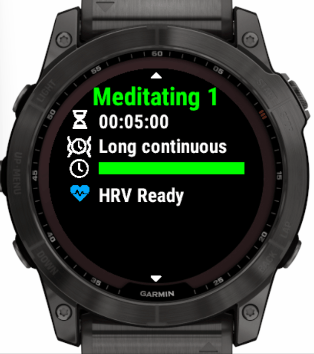
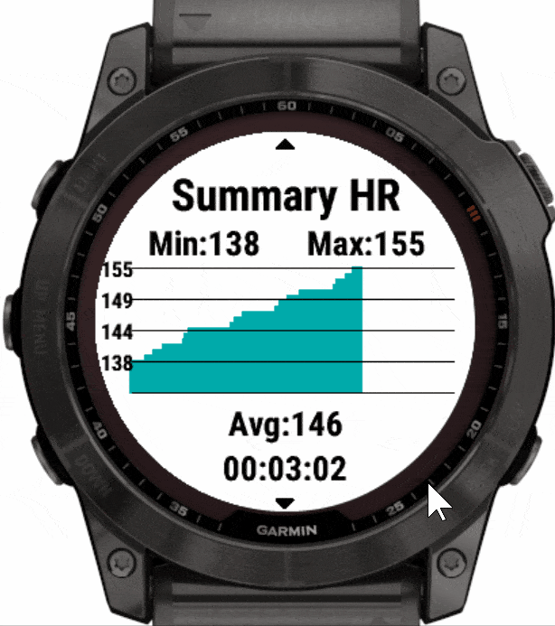

# Meditate

A Garmin Connect IQ meditation app that tracks as an activity the heart rate, HRV, stress, respiration rate provides vibration/sound alerts, heart rate chart and respiration rate chart.

## Features

- ability to save the meditation session as Garmin Connect activity
    - activity type **Meditating** or **Yoga**
- ability to configure multiple meditation/yoga sessions
    - e.g. a 20 min session with 1 min recurring alerts, triggering a different alert on the 10th minute
    - each session supports interval vibration alerts
    - interval alerts can trigger from a few seconds up to few hours
- pre-configured with default meditation sessions for 5/10/15/20/25/30min and also short vibration every 5min
- [HRV](https://en.wikipedia.org/wiki/Heart_rate_variability) (Heart Rate Variability)
    - RMSSD - Root Mean Square of Successive Differences (beat-to-beat intervals)
    - pNN20 - % of successive beat-to-beat intervals that differ by more than 20 ms
    - pNN50 - % of successive beat-to-beat intervals that differ by more than 50 ms
    - beat-to-beat interval - reading coming directly from the watch sensor
    - HRV Successive Differences - difference between the current and previous beat-to-beat intervals
    - SDRR - [Standard Deviation](https://en.wikipedia.org/wiki/Standard_deviation) of beat-to-beat intervals 
      - calculated from the first and last 5 min of the session
    - HRV RMSSD 30 Sec Window - RMSSD calculated for consecutive 30 second intervals    
    - HR from heartbeat - beat-to-beat interval converted to HR
- stress tracking
    - Stress - summary of the the average stress during the session 
    - Average stress for the beginning and end of the session (calculated automatically by the watch for session of 5min or more)
    - HR Peaks 10 Sec Window
      - internal metric for calculating stress 
      - tracks in overlapping 10 Sec Windows Max HR for each window 
      - HR calculated from beat-to-beat interval
- respiration rate
    - Breathes per minute real time in watches that supports it (only works fine for Yoga activity due to bug in Connect IQ API for Breathing activity)
- configurable preparation time before the meditation session
- summary stats at the end of the session
    - Heart rate chart including min, avg and max HR
    - Respiration rate chart including min, avg and max estimated respiration rate
    - Stress
    - HRV
- pause/resume current session using the back button
- ability to configure default custom activity name in Garmin Connect using Garmin Express in PC connected to the watch via USB cable

</img>
</img>

## Supported Devices

- Watches that support Connect IQ >= 3.0 
  - [Garmin app store link](https://apps.garmin.com/en-US/apps/c5fc5ea5-7d12-4fb9-be9c-701663a39db7)
  - from [dliedke/Meditate/tree/main](https://github.com/dliedke/Meditate/tree/main) branch
- Vivoactive 3, Vivoactive 3 Music 
  - [Garmin app store link](https://apps.garmin.com/en-US/apps/bed7ed4d-07ea-4600-b477-b8911670b64a)
  - from [vtrifonov-esfiddle/Meditate/tree/vivoactive3-publish](https://github.com/vtrifonov-esfiddle/Meditate/tree/vivoactive3-publish) branch
  
## [User Guide](UserGuide.md)

## Compilation

- Codebase compatible with Connect IQ SDK v4.1.5 or lower
- If compiling with v4.1.6 or higher, [disable Monkey C type checker](https://forums.garmin.com/developer/connect-iq/f/discussion/314861/sdk-4-1-6-generating-new-errors-and-warnings#pifragment-1298=1)

## Dependencies
- Font for duration picker [Google Roboto](https://fonts.google.com/specimen/Roboto) ([Apache License v2.0](http://www.apache.org/licenses/LICENSE-2.0))
- Status Icons - [Font Awesome free](https://fontawesome.com/license) (SIL OFL 1.1 License) 
