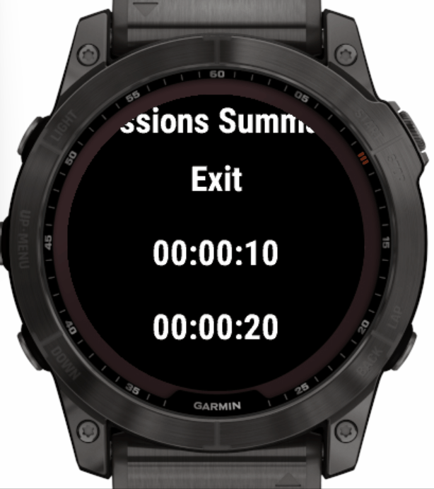
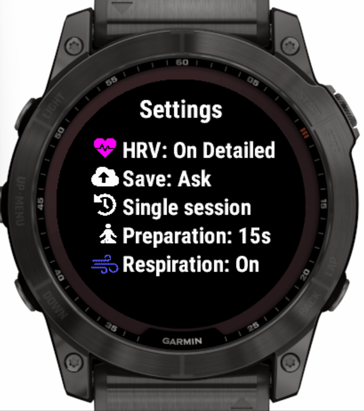

# Meditate con Garmin

## Características

- Guarda tus sesiones de meditación usando Garmin Connect.
   - Opciones de actividad: **Meditación** o **Yoga**.
- Configura múltiples sesiones de meditación/yoga.
   - Por ejemplo, una sesión de 20 min con alertas cada minuto, usando un sonido diferente en el minuto 10.
   - Soporta intervalos de alertas de vibración.
   - Las alertas pueden dispararse desde pocos segundos hasta varias horas.
- Sesiones de meditación preconfiguradas por defecto:
   - Con 5/10/15/20/25/30 min y intervalos de vibración cada 5 min.
- Avanzadas configuraciones de sesión de meditación para 45 min y 1 hora.
- Diferencia de ritmo cardiaco [HRV](https://en.wikipedia.org/wiki/Heart_rate_variability).
   - **RMSSD: Media Cuadrada de las Diferencias Sucesivas** (intervalos de latido a latido).
   - **pNN20**: % de diferencias sucesivas de latido a latido que difieren más de 20 ms.
   - **pNN50**: % de diferencias sucesivas de latido a latido que difieren más de 50 ms.
   - Evalúa intervalos de latido a latido directamente desde el sensor del reloj.
   - HRV y SDRR: [Desviación Estándar](https://en.wikipedia.org/wiki/Standard_deviation) de los intervalos de latido a latido.
     - Calculado desde los primeros y últimos 5 minutos de la sesión.
   - HR basado en ritmo cardiaco: intervalo de latido a latido convertido a HR.

- Seguimiento de estrés
   - **Estrés**: Resumen promedio del estrés durante la sesión.
   - Estrés promedio durante el inicio y final de la sesión (calculado automáticamente por el reloj para sesiones de más de 5 minutos).
  
- Respiración y tasa
   - Respiraciones por minuto registradas en el reloj App para Respiración.

- Resumen de sesión
   - Tamaño de muestra (solo funciona bien para actividad "Yoga" debido a un bug en la API de Conect IQ para el módulo de respiración).

- Configuración personalizable antes de la sesión de meditación.
- Estadísticas resumidas al final de la sesión
   - Incluye gráficos de tasa de respiración y HR, entre otros.

- Pausar/reanudar sesión actual usando el botón trasero.
- Capacidad para configurar nombre de actividad personalizado en Garmin Connect usando Garmin Express en PC conectado al reloj vía USB.

## Cómo usar

### 1. Iniciar una sesión

1.1. Desde la pantalla de selección de sesión, presiona el botón de inicio o toca la pantalla (solo dispositivos táctiles).

1.2. La pantalla de progreso de la sesión muestra lo siguiente:
   - Tiempo transcurrido.
   - Porcentaje de tiempo de sesión transcurrido.
   - Un círculo completo significa que la sesión ha transcurrido.
   - Intervalo de alertas.
   - Las marcas pequeñas de color representan el tiempo de un intervalo de alertas en la sesión.
   - Cada posición marcada corresponde al tiempo de aviso de una alerta.
   - Puedes esconderlas por alerta seleccionando un color transparente.

1.3. Una vez termines la sesión tienes la opción de guardarla.

1.3.1. Puedes configurar para guardar o descartar automáticamente la sesión vía [Configuración Global](#4-global-settings) -> [Confirmar Guardar](#42-configirma-save).

1.4. Si estás en modo sesión única (por defecto) al final verás la pantalla Resumen (para el modo Multisesión ver la siguiente sección).

1.5. Si estás en modo multisesión, entonces regresas a la pantalla de selección de sesión. Desde allí puedes empezar otra sesión. Una vez termines, puedes ver el resumen de la sesión desde la pantalla de Resumen General de Sesiones.

1.6. Desde la vista de Resumen de Sesiones puedes deslizar individualmente en sesiones o salir de la aplicacion. Deslizar hacia abajo muestra estadísticas totales de HR, tasa de Resiliencia, Estrés y HRV. Para volver al menú, presiona el botón.

## 2. Configurando una sesión

2.1. Desde la pantalla de selección de sesión, mantén presionado el botón de menú (medio izquierdo) hasta que veas el menú de Configuración de Sesión.
   - Para dispositivos compatibles táctiles, también es posible tocar y mantener la pantalla.

2.2. En Añadir/New/Edit puedes configurar:
   - Tiempo: duración total de la sesión en H:MM.
   - Color: El color de la sesión usado en controles gráficos; selecciona utilizando el comportamiento de página arriba/abajo en el reloj (Vivoactive 3/4/Venu - desliza arriba/abajo).
   - Patrón de vibración: patrones más cortos o más largos que van desde pulsar continuamente.
   - Intervalo de Alertas: habilidad para configurar múltiples alertas intermedias.
     - Una vez que estás en un intervalo específico, ves en el menú ingresar el nombre de la Alerta/ID (por ejemplo, Alerta 1) referente a las alertas de intervalo actuales.
     - Tiempo:
       - selección única de alerta o punto de alerta repetitiva
       - las alertas repetitivas permiten duraciones más cortas que un minuto
       - solo una alerta única se ejecutará en cualquier momento dado
       - prioridad de alertas con el mismo tiempo
         1. alerta final de sesión
         2. primera alerta única
         3. alerta repetitiva
     - Color: el color del intervalo de alerta actual utilizado en los controles gráficos. Selecciona colores diferentes para cada alerta para diferenciarlas durante la meditación. Selecciona el color transparente si no quieres ver marcas visuales durante la alerta de meditación.
   - Patrón de vibración/Sonido: patrones más cortos o más largos que van desde pulsar continuamente.
   - Tipo de actividad: habilidad para guardar la sesión como **Meditación** o **Yoga**. Puedes configurar el tipo de actividad por defecto para nuevas sesiones desde la Configuración Global ([ver sección 4](#4-global-settings)).

## 3. Seleccionando una sesión

Desde la pantalla de selección de sesión, presiona los botones de página arriba/abajo. Puedes ver los ajustes aplicables para la sesión seleccionada.
- Tipo de actividad: en el título.
- Meditación.
- Tiempo: duración total de la sesión.
- Patrón de vibración.
- Intervalo de alertas: el gráfico en medio de la pantalla representa el tiempo relatvo de alerta comparado con el tiempo total de sesión.
- Indicador HRV.

## 4. Ajustes Globales

Desde la pantalla de selección de sesión, mantén presionado el botón de menú (o toca y mantén la pantalla) hasta ver el menú de Configuración de Sesión. Selecciona el Menú de Ajustes Globales. Verás una vista con el estado de las configuraciones globales. Mantén presionando el botón de menú nuevamente (o toca y mantén la pantalla) para editar los ajustes globales.

### 4.1 HRV Tracking

Este ajuste proporciona la **HRV Tracking** por defecto para nuevas sesiones.

- **Activado**: rastrea por defecto métricas de HRV y Estrés.
  - RMSSD
  - Diferencias Sucesivas
  - Estrés
  - latido a latido intervalos
  - pNN50
  - pNN20
  - HR desde ritmo cardiaco
  - RMSSD 30 Sec Ventana
  - HR Picos 10 Sec Ventana
  - SDRR Primeros 5 min de la sesión
  - SDRR Últimos 5 min de la sesión
- **Desactivado**: HRV y seguimiento del estrés apagado.

### 4.2 Confirmar Save

- **Preguntar**: cuando una actividad finaliza pregunta si guardar.
- **Auto Sí**: cuando una actividad finaliza, lo guarda automáticamente.
- **Auto No**: cuando una actividad finaliza, lo descarta automáticamente.

### 4.3 Multi-Sesión

- **Sí**
  - la app continúa funcionando después de finalizar una sesión.
  - esto te permite grabar múltiples sesiones.
- **No**
  - la app se cierra después de finalizar una sesión.

### 4.4 Tiempo de Preparación

- **0 seg**: Sin tiempo de preparación.
- **15 seg** (Predeterminado): 15s para prepararse antes de comenzar la sesión de meditación.
- **30 seg**: 30s para prepararse antes de comenzar la sesión de meditación.
- **60 seg**: 1min para prepararse antes de comenzar la sesión de meditación.

### 4.5 Tasa de Respiración (nota: algunos dispositivos no soportan esta característica)

- **Activado** (Predeterminado): métricas de tasa de respiración habilitadas durante la sesión.
- **Desactivado**: métricas de tasa de respiración desactivadas durante la sesión.

### 4.6 Nuevo Tipo de Actividad

Puedes configurar el tipo de actividad por defecto para nuevas sesiones.

- **Meditación**
- **Yoga**
